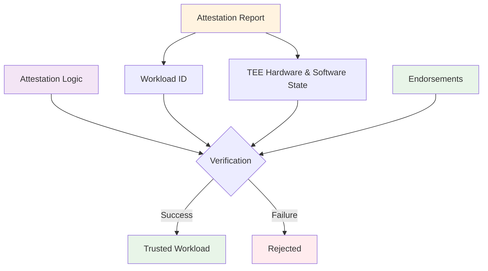

# TEE design patterns

Created time: September 5, 2025 11:42 AM

## **Terminology**

**Workload Identity**: The specific software running inside a TEE. Its identity is derived from measurement registers that contain cryptographic hashes of loaded code and configuration.

**DCAP Endorsements:** Data provided by Intel that serves as the trust anchor for attestation verification. This includes QE Identity information, TCB Info, certificates, and related data. It is used to verify the hardware & software state of the TEE platform.

**Attestation consumables:** The workloadid, the hardware & software state, the endorsements and the attestation logic verifying these inputs.

## High level attestation flow



This diagram illustrates the core components required for successful TEE attestation verification:

- The **Attestation Report** (orange) contains both the Workload ID and the current TEE Hardware & Software State
- The **Attestation Logic** (purple) serves as the verification engine that processes all inputs
- **Endorsements** (green) are reference values used by the Attestation Logic to verify the TEE's hardware and software state, but not the workload identity

One important aspect is that the TEE's platform integrity is verified by comparing the reported hardware/software state against trusted endorsements while the Workload ID verification is usually not part of this standard attestation flow and will only later be verified by custom logic.

## What makes designing TEE apps special?

In normal software development, you deploy code to servers you control, users download apps they choose to trust, and security means controlling who can access what and keeping sensitive data encrypted. You assume your execution environment is trustworthy because you built it, configured it, or at least chose it. TEEs shatter this assumption entirely. You can't just assume software running in a TEE is secure - you have to prove it via attestation to complete strangers who trust nothing. This transformation from assumed trust to hardware based proof is the single gravitational force that makes every aspect of TEE engineering exponentially more complex than traditional software development.

## Reproducible Builds and the 3rd party trust problem

Most web2 TEE projects don’t really care about reproducible builds. One reason might be, because they’re witnessing their own build process while at the same time being the only user of the respective workloads. The moment a 3rd party, which is an external user of the system, steps in - a problem arises. Builds tend to be non deterministic and witnessing the build process isn’t easy to achieve for everyone.

This creates a fundamental trust gap: third parties must trust that the workload identity they're verifying through attestation actually corresponds to the source code they've reviewed, but they have no independent way to verify this claim since they cannot practically witness or reproduce the original build process.

Reproducible builds solve this problem by ensuring that identical source code always produces identical binary outputs, regardless of when, where, or by whom the build is performed. This determinism allows third parties to independently compile the source code and verify that their resulting workload identity matches the one running in the TEE. However, achieving true reproducibility requires careful control of build environments, timestamps, compiler versions, and other factors that typically introduce variability into the build process.

Web3 projects have a special role here because the 3rd party trust problem applies to all of them, users haven’t witnessed the build process to these TEE workloads plus are usually used to high security guarantees like consensus etc. that distributed systems provide.

**Pragmatic Alternatives: Trusted Binary Sources**

When fully reproducible builds prove infeasible due to complex dependencies, legacy toolchains, or resource constraints, a pragmatic alternative involves sourcing binaries from established trusted parties. This approach leverages signed binaries from reputable sources such as official Linux distribution package repositories, which already maintain rigorous security practices and code review processes. Given that TEE systems already place trust in hardware manufacturers and cloud providers, expanding this trust model to include well-established software distributors represents a measured trade-off rather than a fundamental security compromise. However, this approach requires complete transparency about which trusted sources are being used and why, allowing users to make informed decisions about their acceptable risk profile. The security posture of these binary sources becomes critical - they must demonstrate strong operational security, regular security audits, and robust signing key management practices.

## Trusted Computing Base and it’s security implications

## Governance and Data Availability

While fully reproducing a workload identity from source code is required to establish trust with users, most users will and should not be required to follow this validation step. Also, TEEs themselves aren’t capable of verifying source code, at least for now they do not have the cognitive capacity. They need to be told in advance what the valid workload ids are. Assuring only valid workload ids are able to partake in the network is security critical. If one can change the workload of a TEE, the integrity and thus also the privacy guarantees of the system are lost.

But who decides on what the valid workload identities of a TEE system are? And how can we assure the DA of these identities such that attestation will always be possible?

Storing workload identity measurements on github by developers might be OK for a PoC, but is not sufficient for production level systems. Developers can be blackmailed or greedy and should not have this responsibility. Also in terms of end user trust, it is much better if [devs can’t rug](https://docs.google.com/document/d/1lQ6LqvaWQhj-1zxXElwMfXjUc_daXV8zDwi1vQtrArE/edit?tab=t.0).

A governance body that decides on workload identities, and must have multiple flows for different updates, security critical updates must happen fast and be expedited, whole normal patches or feature updates can be handled differently.

Likewise for the data availability of these measurements, a production system needs a strong mechanism in place that secures the DA. The chain is usually the obvious answer for web3 projects.

# TEE Provisioning: Bridging Static Trust and Dynamic Configuration

## What is TEE Provisioning?

TEE provisioning addresses the fundamental tension between attestable determinism and operational flexibility. While TEEs derive trustworthiness from predictable, measurable boot processes, real-world applications require dynamic loading of secrets configuration data or even complete workloads including container files and binaries (as seen with CoCo/Dstack).

Consider a confidential microservice that needs to connect to different databases based on environment, enable customer-specific features, or rotate encryption keys without redeployment. Traditional configuration approaches would break TEE security guarantees, but proper provisioning maintains both flexibility and verifiable integrity.

The challenge lies in extending the TEE's trusted computing base to include dynamically loaded content while preserving the attestability that makes TEEs trustworthy in the first place.

## Config and Workload Provisioning

Config and workload provisioning involves securely loading and validating dynamic content into a TEE while maintaining attestability. Since measurement registers and attestation fields are limited to hash-sized values, the dynamically loaded content is represented as cryptographic hashes throughout both approaches described below. While we use the term "config provisioning" throughout this document for brevity, the scope extends far beyond simple configuration files to include complete workloads, container images, application binaries, and entire runtime environments - as seen in systems like CoCo and Dstack where the base image is minimal and the actual application is loaded dynamically post-boot.

### Approach 1: Measurement Extension

In this approach, configuration content is loaded dynamically and then cryptographically recorded in the TEE's measurement registers. Verifiers must understand the extension logic to validate the final state.

**Process Flow:**
1. TEE loads configuration from external source
2. Configuration is validated against security policies
3. Configuration hash is extended into measurement register (PCR/RTMR)
4. Attestation quote reflects the extended measurements
5. Verifiers validate both base measurements and extension sequence

```rust
// Conceptual measurement extension
extend_pcr(config_pcr, sha256(config_bytes))
```

**AMD SEV-SNP specifics:**

- uses a vTPM with PCRs to record application/runtime measurements; reserve PCRs (e.g., 10–15) for app-level use when feasible
- Extension function: `PCR[i] = SHA256(PCR[i] || value)` where `value` is a digest of a canonicalized configuration manifest (prefer manifest-over-file-by-file to avoid ordering/whitespace pitfalls)
- Prefer extending a single, canonical manifest hash rather than many small items to simplify verification and avoid ambiguous sequences

**Intel TDX specifics:**

- Runtime Measurement Registers `RTMR[0..3]` are available for runtime content. `RTMR[3]` is dedicated to extend measurements after boot. The extendability of `RTMR[0]..[2]` post-boot is restricted
- Extension function: `RTMR[i] = SHA384(RTMR[i] || value)` where `value` is a digest of a canonicalized configuration manifest
- A direct mapping exists between TPM PCRs and TDX RTMRs for compatibility with existing tooling

### Approach 2: Pre-defined Configuration Validation

Valid configuration hashes are embedded in the TEE at build time or provided through operator-defined attestation values. The provisioning process validates configuration against these pre-defined values rather than extending measurements.

**Process Flow:**
1. Expected configuration hash is set during deployment (MRCONFIGID, HOSTDATA)
2. TEE receives configuration from external source
3. Configuration is hashed using deterministic algorithm
4. Hash is compared against value in attestation quote
5. Configuration is applied only if validation succeeds

```rust
// Conceptual pre-validation
if sha256(provided_config) == attestation_quote.mrconfigid {
    apply_config(provided_config)
}
```

**Intel TDX specifics:** `MRCONFIGID` can be set by the platform/VMM at TD creation to pin an expected configuration hash (e.g., hash of a signed config bundle/manifest). This enables a simple compare inside the TEE. Additional related identity/configuration fields include `MROWNER` (platform/owner identity) and `MROWNERCONFIG` (owner-provided configuration identity). Base measurement `MRTD` and runtime measurements `RTMR[0..3]` are part of the report. These fields are established by the platform/VMM and are not modifiable by the guest runtime.

**AMD SEV-SNP specifics:** `HOST_DATA` can be provided by the platform at VM launch to carry an expected configuration hash for comparison.

### Key Considerations and Trade-offs

**Platform Availability Limitations:** Availability of these features is cloud-/platform-dependent. Some cloud providers do not expose tenant control over `HOST_DATA` (or over TDX `MRCONFIGID`). In such environments, prefer the measurement-extension approach.

**Caution on REPORTDATA/REPORT_DATA:** Both TDX `REPORTDATA` and AMD SEV-SNP `REPORT_DATA` are guest-controlled fields intended for binding ephemeral, runtime-provided data into a report. Because they are writable by the running workload, they must not be used to validate configuration provenance or to gate configuration application. Using these fields for configuration validation can be exploited by a compromised runtime.

**Measurement extension** provides maximum flexibility but complicates verification since attestation consumers must understand the exact sequence of measurement extensions. This approach is straightforward and can be understood well, but comes with the added hassle of having to deal with extending measurements and a more complicated attestation verification process that needs to be aware of measurement extension logic. This approach suits dynamic environments where configuration changes frequently.

**Pre-defined validation** trades flexibility for simplicity, requiring configuration approval at deployment time but enabling straightforward verification through single hash comparison. The second approach is more difficult to grasp conceptually but simplifies the verification process. This approach aligns with production environments where configuration changes follow formal approval processes.

# CVM Maintenance Access and Runtime Modifications

## The Determinism Challenge

Confidential Virtual Machines (CVMs) derive their trustworthiness from deterministic behavior that can be verified through attestation. When a CVM boots, its attestation quote provides cryptographic proof of the exact software stack loaded at initialization. External parties can independently verify what's running inside the CVM by comparing the attestation measurements against known good values from reproducible builds - creating a trust model similar to smart contracts where interactions are predictable based on verified code.

However, the moment you introduce external modification capabilities - such as passing `docker.sock` to enable dynamic container management, SSH access for debugging, or any runtime configuration changes - you fundamentally break this determinism. External parties can no longer make reliable predictions about the CVM's behavior because the running software may have diverged from what was initially attested.

## Security Implications of External Access

### Docker Socket Exposure

Exposing the Docker daemon socket (`docker.sock`) to a CVM presents significant security trade-offs:

**Weakened Isolation**: The Docker daemon typically runs with elevated privileges and provides broad system access. Exposing this interface effectively grants the ability to:

- Load arbitrary container images and execute unverified code
- Mount host file systems and access sensitive data
- Modify network configurations and bypass intended isolation
- Potentially escape the CVM boundary through container breakouts

**Attestation Invalidation**: Any containers started via the exposed Docker socket will not be reflected in the original attestation measurements, creating a gap between what was verified and what's actually running.

**Trust Boundary Confusion**: Users may incorrectly assume that the entire system maintains CVM security properties when in reality, dynamically loaded components operate outside the trusted computing base.

## Approach 1: Transparent Modification Tracking ("Training Wheels")

This approach maintains modification capability while preserving auditability through comprehensive logging of all changes.

### Implementation Strategies

**RTMR Extension**: Extend Runtime Measurement Register 4 (RTMR4) with cryptographic hashes of every command executed via external interfaces:

```bash
# Before executing any SSH command or Docker operation
echo "docker run nginx:latest" | sha256sum >> /sys/kernel/security/integrity/ima/ascii_runtime_measurements
# Then execute the actual command

```

**On-Chain Command Logging**: Have the TEE's controlled address publish all modification requests as blockchain transactions before execution:

```solidity
contract CVMCommandLog {
    event CommandExecuted(address indexed tee, bytes32 commandHash, uint256 timestamp);

    function logCommand(bytes32 _commandHash) external {
        require(isTrustedTEE[msg.sender], "Unauthorized TEE");
        emit CommandExecuted(msg.sender, _commandHash, block.timestamp);
        // Command execution happens after on-chain logging
    }
}

```

### Trade-offs

**Advantages**:

- Maintains operational flexibility during development phases
- Provides complete audit trail of modifications
- Allows gradual transition toward more restrictive models

**Disadvantages**:

- Requires users to continuously monitor and understand modification logs
- Places cognitive burden on third parties to assess security implications
- Creates scaling challenges as modification history grows

## Approach 2: Deterministic Modification APIs

This approach transforms unpredictable runtime modifications into deterministic, code-defined behaviors that are part of the original attestation.

### Design Principles

**Pre-defined Modification Scope**: All possible runtime changes must be explicitly defined in the initial code and reflected in attestation measurements:

```rust
// Example: Deterministic configuration update API
pub enum AllowedModifications {
    UpdateLogLevel(LogLevel),
    RotateEncryptionKey { key_derivation: KeyDerivationMethod },
    ScaleWorkerThreads { min: u32, max: u32 },
    // Exhaustive list of permitted changes
}

impl CVMModificationAPI {
    pub fn apply_modification(&mut self, modification: AllowedModifications) -> Result<()> {
        match modification {
            AllowedModifications::UpdateLogLevel(level) => {
                // Deterministic implementation
                self.set_log_level(level)
            },
            // ... other deterministic handlers
        }
    }
}

```

**Bounded Complexity**: Modification logic must be simple, auditable, and non-adversarial. Complex conditional logic or external data dependencies should be avoided.

**Cryptographic Verification**: API endpoints should require cryptographic proof of authorization, typically through signature verification against pre-defined public keys embedded in the initial attestation.

### Implementation Example

```rust
pub struct SecureModificationEndpoint {
    allowed_signers: HashSet<PublicKey>,
    modification_log: Vec<ModificationRecord>,
}

impl SecureModificationEndpoint {
    pub async fn handle_modification_request(
        &mut self,
        request: SignedModificationRequest
    ) -> Result<ModificationResponse> {
        // 1. Verify signature against allowed signers
        self.verify_signature(&request)?;

        // 2. Validate modification is within allowed scope
        let modification = self.parse_modification(&request.payload)?;

        // 3. Apply deterministic change
        let result = self.apply_modification(modification)?;

        // 4. Log modification for audit trail
        self.log_modification(&request, &result);

        Ok(result)
    }
}

```

## Secure and attested communication

Secure and attested communication is the cornerstone of every TEE system; depending on the complexity of the system, the communication can happen within the following network topologies

### 1 to 1 communication

example: the system contains two TEEs. They need to communicate with each other

solution: make A and B aware of each others valid workload identities, then initiate mutual attestation + secure channel, i.e. attested TLS

### n to 1 communication

example: the system contains a lot of TEE instances with different workloads that all communicate with one static workload instance

solution: make all As aware of B, curate a list of A workloads in B, initiate mutual attestation + secure channel, i.e. attested TLS

### n to m communication

example: multiple TEE instances with different workloads all need to communicate with each other

solution: 

- PKI, like in n to 1, we have a central entity curating the list of workloads and acting as the root authority, signing communication keys for all other workloads
- p2p, valid workload identities are distributed via a distributed network, TEE peers first need to connect to the network, fetch the curated workload list, and based on that they can start secure and attested channels with other peers
